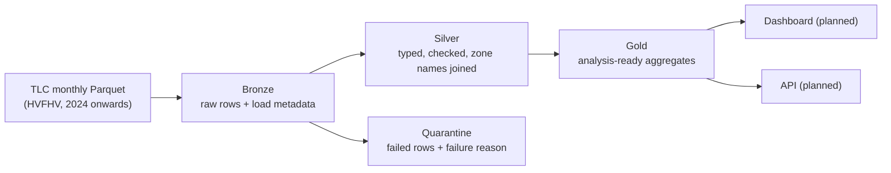

# mobility-lakehouse

[](https://github.com/NafiulSaputra/mobility-lakehouse/actions/workflows/ci.yml)

End-to-end Databricks lakehouse for NYC ride-hailing trip data (NYC TLC High Volume For-Hire Vehicle records).
Incremental, idempotent bronze/silver/gold pipelines with Delta Lake, explicit data quality checks with quarantine,
CI/CD, and architecture decision records.

> **Status: work in progress (Sprint 0).** The architecture and decisions are documented. Pipeline code is not
> written yet. The [roadmap](#roadmap) shows what is done and what is planned. Nothing in this README describes a
> feature as working until it is.

## The problem

NYC publishes millions of ride-hailing trips every month, but the raw files are not ready for analysis:

- **Files arrive late and can change.** Data is published monthly, usually about two months late, and older files
  can be updated after release. Any single month must be reprocessable safely.
- **The source does not guarantee accuracy.** The data is not created by the TLC, and the TLC makes no claim that it
  is accurate. Impossible values (negative fares, trips that end before they start) must not reach reports.
- **Reruns must not duplicate data.** Pipelines fail and get rerun. Running the same month twice must give exactly
  the same result.
- **The schema changes over time.** For example, a `cbd_congestion_fee` column was added for 2025 data onwards.
  Schema changes must be handled on purpose, not silently.

`mobility-lakehouse` turns these files into trusted, analysis-ready Delta tables on Databricks. Every run is
idempotent, every rejected row is kept with its reason, and any month can be reprocessed on its own.

## Architecture



| Layer | Contains | Write strategy |
|---|---|---|
| Bronze | Source rows as delivered, plus source file name, load time and data month | Overwrite one month per run |
| Silver | Rows that passed all quality rules, with correct types and taxi zone names | Overwrite one month per run |
| Quarantine | Rows that failed at least one rule, with the rule name(s) | Overwrite one month per run |
| Gold | Aggregated tables for analysis (defined in a later ADR) | Rebuilt from silver |

## Key decisions

Every significant decision is recorded as an Architecture Decision Record in [`docs/adr`](docs/adr/).

| ADR | Decision |
|---|---|
| [0001](docs/adr/0001-medallion-architecture-with-delta-lake.md) | Use a medallion architecture (bronze, silver, gold) on Delta Lake |
| [0002](docs/adr/0002-scope-hvfhv-2024-onwards.md) | Scope v0.1.0 to the HVFHV dataset, January 2024 onwards |
| [0003](docs/adr/0003-idempotent-monthly-partition-overwrite.md) | Make runs idempotent by overwriting one month partition per run |
| [0004](docs/adr/0004-quarantine-failed-rows.md) | Keep rows that fail quality checks in a quarantine table with the reason |
| [0005](docs/adr/0005-local-spark-in-docker-pinned-to-databricks.md) | Develop locally with Spark in Docker, pinned to Databricks serverless versions |
| [0006](docs/adr/0006-data-quality-rules-and-silver-schema.md) | Quality rules (7 reject, 5 warning) and silver schema, based on profiling two months |

## Roadmap

### Stage 1: batch lakehouse (target: v0.1.0)

- [x] Sprint 0: environment, repository, README and first ADRs
- [x] Sprint 0: code quality tooling (ruff, pytest, pre-commit, pipeline-lint, GitHub Actions)
- [x] Sprint 1: local Spark + Delta in Docker, sample data, data profiling reports ([2024-06](docs/profiling/fhvhv_2024-06.md), [2025-01](docs/profiling/fhvhv_2025-01.md))
- [ ] Sprint 2: bronze ingestion with idempotency tests
- [ ] Sprint 3: silver quality rules, quarantine table and per-run quality metrics
- [ ] Sprint 4: gold tables and deployment to Databricks with Asset Bundles

### Later stages (target: v1.0)

- [ ] Stage 2: dashboard on the gold tables
- [ ] Stage 3: FastAPI service serving gold metrics
- [ ] Stage 4: simulated streaming (replay of historical trips through Redpanda) with late-data handling
- [ ] Benchmarks with documented, repeatable methodology

## Tech stack

Python 3.12 · PySpark 4.1 · Delta Lake 4.3 · Databricks (Free Edition, serverless) · Databricks Asset Bundles ·
Docker · uv · pytest · ruff · [pipeline-lint](https://github.com/NafiulSaputra/pipeline-lint) · GitHub Actions

Python 3.12 matches Databricks serverless environment version 5.

## Development

Requirements: [uv](https://docs.astral.sh/uv/), Git and Docker.

```bash
uv sync                          # create .venv with Python 3.12 and the dev tools
uv run pre-commit install        # run checks automatically before every commit
uv run pytest                    # tests
uv run ruff check .              # lint
uv run ruff format .             # format
uv run pipeline-lint check .     # rerun-safety checks for pipeline code
```

Spark runs in Docker with versions pinned to Databricks serverless ([ADR 0005](docs/adr/0005-local-spark-in-docker-pinned-to-databricks.md)):

```bash
uv run mobility-lakehouse download --month 2025-01             # raw file into data/ (safe to rerun)
docker compose build spark                                      # once, or after dependency changes
docker compose run --rm spark mobility-lakehouse profile --month 2025-01
```

Profiling reports are written to [`docs/profiling`](docs/profiling/).

CI runs the lint, format, pipeline-lint and test checks on every pull request and on `main`.

## Data source and license

Trip data comes from the [NYC Taxi & Limousine Commission (TLC) Trip Record Data](https://www.nyc.gov/site/tlc/about/tlc-trip-record-data.page).
This project is not affiliated with the TLC. The TLC states that it does not guarantee the accuracy of these records.

The code in this repository is licensed under the [Apache License 2.0](LICENSE).

## Author

Nafiul Hadi Saputra · [GitHub](https://github.com/NafiulSaputra) ·
[LinkedIn](https://www.linkedin.com/in/nafiul-hadi-saputra-bb7037439)
