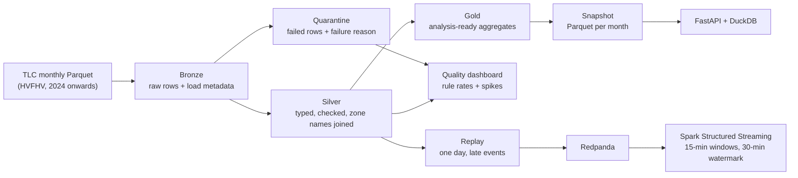
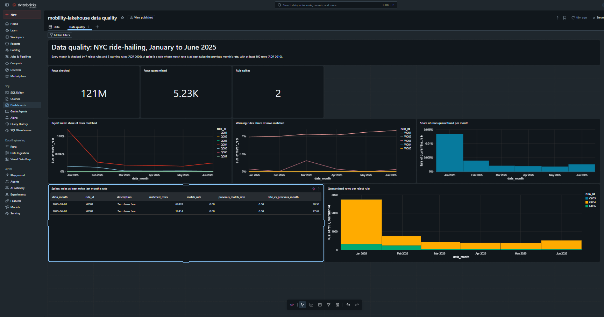

# mobility-lakehouse

[](https://github.com/NafiulSaputra/mobility-lakehouse/actions/workflows/ci.yml)

End-to-end Databricks lakehouse for NYC ride-hailing trip data (NYC TLC High Volume For-Hire Vehicle records).
Incremental, idempotent bronze/silver/gold pipelines with Delta Lake, explicit data quality checks with quarantine,
CI/CD, and architecture decision records.

> **Status: v0.1.0, batch lakehouse complete.** Bronze, silver and gold run locally in Docker and as a
> Databricks job, with the same results on both. A data quality dashboard, an HTTP API and a
> streaming replay are done; benchmarks and v1.0 are next
> (see the [roadmap](#roadmap)). Changes per release are in the [changelog](CHANGELOG.md).

## The problem

NYC publishes millions of ride-hailing trips every month, but the raw files are not ready for analysis:

- **Files arrive late and can change.** Data is published monthly, usually about two months late, and older files
  can be updated after release. Any single month must be reprocessable safely.
- **The source does not guarantee accuracy.** The data is not created by the TLC, and the TLC makes no claim that it
  is accurate. Impossible values (negative fares, trips that end before they start) must not reach reports.
- **Reruns must not duplicate data.** Pipelines fail and get rerun. Running the same month twice must give exactly
  the same result.
- **The schema changes over time.** For example, a `cbd_congestion_fee` column was added for 2025 data onwards.
  Schema changes must be handled on purpose, not silently.

`mobility-lakehouse` turns these files into trusted, analysis-ready Delta tables on Databricks. Every run is
idempotent, every rejected row is kept with its reason, and any month can be reprocessed on its own.

## Architecture



| Layer | Contains | Write strategy |
|---|---|---|
| Bronze | Source rows as delivered, plus source file name, load time and data month | Overwrite one month per run |
| Silver | Rows that passed every reject rule, with taxi zone names and their warning rule IDs | Overwrite one month per run |
| Quarantine | Rows that failed at least one reject rule, with the rule IDs | Overwrite one month per run |
| Rule counts | Rows matched per quality rule per month, to spot changes in the source | Overwrite one month per run |
| Gold | Daily trips per company, hourly busy zones, monthly driver economics | Rebuilt from silver, one month per run |

Column-level details: [docs/data-model.md](docs/data-model.md).

## Results

January 2025 (20.4 million trips), run locally in Docker and on Databricks Free Edition serverless:

| Measure | Local (Docker) | Databricks |
|---|---|---|
| Bronze rows | 20,405,666 | 20,405,666 |
| Silver rows | 20,402,922 | 20,402,922 |
| Quarantined rows (negative fare, negative driver pay, drop-off before pickup) | 2,744 | 2,744 |
| Uber / Lyft trips in gold | 15,353,745 / 5,049,177 | 15,353,745 / 5,049,177 |

The Databricks job (bronze, silver, gold) took 3 minutes 17 seconds, including compute start-up. Running the
same month a second time left every table count unchanged. Details: [ADR 0009](docs/adr/0009-running-on-databricks.md).

### Data quality dashboard

January to June 2025 on Databricks AI/BI. The dashboard is defined as code in
[`dashboards/`](dashboards/) and deployed with the Asset Bundle ([ADR 0010](docs/adr/0010-data-quality-dashboard.md)).



- About 121 million rows checked, about 5,200 quarantined (0.004%).
- January 2025 had the most quarantined rows (2,744), mostly negative base fares (rule Q004).
- Two spikes in six months, both from rule W003 (zero base fare): it matched about 50 times its February
  rate in March (63,828 rows) and about 98 times its May rate in June (12,414 rows). No step failed,
  because W003 is a warning: the change was only visible by comparing months, which is what the dashboard
  is for.

## API

A FastAPI service serves gold metrics and the quality summary from a Parquet snapshot, read with DuckDB
([ADR 0011](docs/adr/0011-api-over-a-parquet-snapshot.md)). It needs no Spark and no Databricks connection.

| Endpoint | Returns |
|---|---|
| `GET /health` | Status and the months in the snapshot |
| `GET /drivers/economics?month=2025-03` | Driver pay per mile and per minute, per company |
| `GET /trips/daily?start=2025-03-01&end=2025-03-31` | Trips, fares, tips and driver pay per day and company |
| `GET /zones/busiest?month=2025-03&hour=18&limit=10` | Pickup zones with the most trips |
| `GET /quality/monthly` | Rows checked and quarantined per month, and the rules that spiked |

```bash
docker compose up --build api                 # http://localhost:8000/docs for the interactive documentation
curl "http://localhost:8000/drivers/economics?month=2025-03"
```

Bad input gets a clear status code: `422` for a badly written month, an hour outside 0 to 23 or a date range
longer than 92 days, and `404` for a month that is not in the snapshot.

## Streaming

One day of silver trips is replayed through Redpanda faster than real time, with 2% of the events sent up to
90 minutes late and out of order. Spark Structured Streaming counts trips per pickup zone and 15-minute window
with a 30-minute watermark and merges the results into Delta
([ADR 0012](docs/adr/0012-streaming-replay-with-watermark.md)).

- An event up to 30 minutes late is still counted in its window; an older one is dropped, and the number of
  dropped events is reported, so every missing trip is explained.
- The replay uses a fixed seed, so the same command always produces the same stream.
- A Spark test checks the watermark: a late event inside it updates its window, an older one is dropped and
  counted, and a run without new events changes nothing.

Step by step: [docs/streaming.md](docs/streaming.md).

## Key decisions

Every significant decision is recorded as an Architecture Decision Record in [`docs/adr`](docs/adr/).

| ADR | Decision |
|---|---|
| [0001](docs/adr/0001-medallion-architecture-with-delta-lake.md) | Use a medallion architecture (bronze, silver, gold) on Delta Lake |
| [0002](docs/adr/0002-scope-hvfhv-2024-onwards.md) | Scope v0.1.0 to the HVFHV dataset, January 2024 onwards |
| [0003](docs/adr/0003-idempotent-monthly-partition-overwrite.md) | Make runs idempotent by overwriting one month partition per run |
| [0004](docs/adr/0004-quarantine-failed-rows.md) | Keep rows that fail quality checks in a quarantine table with the reason |
| [0005](docs/adr/0005-local-spark-in-docker-pinned-to-databricks.md) | Develop locally with Spark in Docker, pinned to Databricks serverless versions |
| [0006](docs/adr/0006-data-quality-rules-and-silver-schema.md) | Quality rules (7 reject, 5 warning) and silver schema, based on profiling two months |
| [0007](docs/adr/0007-explicit-bronze-schema-contract.md) | Bronze follows an explicit schema contract; unknown source columns stop the load |
| [0008](docs/adr/0008-gold-tables.md) | Gold has one table per business question; ratios are computed from totals |
| [0009](docs/adr/0009-running-on-databricks.md) | The same pipeline steps run locally and as a Databricks Asset Bundle job on serverless |
| [0010](docs/adr/0010-data-quality-dashboard.md) | A Databricks AI/BI dashboard shows quality rule rates per month and flags spikes |
| [0011](docs/adr/0011-api-over-a-parquet-snapshot.md) | The API reads a Parquet snapshot of gold with DuckDB instead of querying Databricks |
| [0012](docs/adr/0012-streaming-replay-with-watermark.md) | Streaming replays a day through Redpanda; a 30-minute watermark decides which late events count |

## Roadmap

### Stage 1: batch lakehouse (target: v0.1.0)

- [x] Sprint 0: environment, repository, README and first ADRs
- [x] Sprint 0: code quality tooling (ruff, pytest, pre-commit, pipeline-lint, GitHub Actions)
- [x] Sprint 1: local Spark + Delta in Docker, sample data, data profiling reports ([2024-06](docs/profiling/fhvhv_2024-06.md), [2025-01](docs/profiling/fhvhv_2025-01.md))
- [x] Sprint 2: bronze ingestion with idempotency tests, run in CI on every pull request
- [x] Sprint 3: silver quality rules, quarantine table and per-rule quality counts ([data model](docs/data-model.md))
- [x] Sprint 4a: gold tables (daily trips per company, hourly busy zones, monthly driver economics)
- [x] Sprint 4b: run the pipeline on Databricks with Asset Bundles ([runbook](docs/runbook-databricks.md)), release v0.1.0

### Later stages (target: v1.0)

- [x] Sprint 5: data quality dashboard on Databricks AI/BI, deployed with the bundle, six months loaded
- [ ] Business dashboard pages on the gold tables
- [x] Sprint 6: FastAPI service over a Parquet snapshot of gold, read with DuckDB, tested in CI
- [x] Sprint 7: streaming replay through Redpanda with late events, Spark Structured Streaming with a 30-minute watermark
- [ ] Sprint 8: reconcile the stream with batch gold, live replay demo
- [ ] Benchmarks with documented, repeatable methodology

## Tech stack

Python 3.12 · PySpark 4.1 · Delta Lake 4.3 · Databricks (Free Edition, serverless) · Databricks Asset Bundles ·
Databricks AI/BI · FastAPI · DuckDB · Redpanda · Docker · uv · pytest · ruff · [pipeline-lint](https://github.com/NafiulSaputra/pipeline-lint) · GitHub Actions

Python 3.12 matches Databricks serverless environment version 5.

## Development

Requirements: [uv](https://docs.astral.sh/uv/), Git and Docker.

```bash
uv sync                          # create .venv with Python 3.12 and the dev tools
uv run pre-commit install        # run checks automatically before every commit
uv run pytest                    # tests
uv run ruff check .              # lint
uv run ruff format .             # format
uv run pipeline-lint check .     # rerun-safety checks for pipeline code
```

Spark runs in Docker with versions pinned to Databricks serverless ([ADR 0005](docs/adr/0005-local-spark-in-docker-pinned-to-databricks.md)):

```bash
uv run mobility-lakehouse download --month 2025-01             # raw file + zone lookup (safe to rerun)
docker compose build spark                                      # once, or after dependency changes
docker compose run --rm spark mobility-lakehouse profile --month 2025-01
docker compose run --rm spark mobility-lakehouse bronze --month 2025-01    # safe to rerun
docker compose run --rm spark mobility-lakehouse silver --month 2025-01    # quality rules, safe to rerun
docker compose run --rm spark mobility-lakehouse gold --month 2025-01      # gold tables, safe to rerun
docker compose run --rm spark mobility-lakehouse snapshot --month 2025-01  # Parquet for the API, safe to rerun
docker compose run --rm spark pytest -m spark                              # Spark tests
```

On Databricks, the same steps run as a four-task job defined in [`databricks.yml`](databricks.yml).
The step-by-step guide is in the [Databricks runbook](docs/runbook-databricks.md):

```bash
databricks bundle deploy --profile mobility
databricks bundle run monthly_pipeline --profile mobility --params month=2025-01
```

Profiling reports are written to [`docs/profiling`](docs/profiling/).

CI runs two jobs on every pull request and on `main`: lint, format, pipeline-lint and unit tests, and the Spark
tests that prove every layer is idempotent, every quality rule works and the full pipeline runs from raw
files to gold.

## Data source and license

Trip data comes from the [NYC Taxi & Limousine Commission (TLC) Trip Record Data](https://www.nyc.gov/site/tlc/about/tlc-trip-record-data.page).
This project is not affiliated with the TLC. The TLC states that it does not guarantee the accuracy of these records.

The code in this repository is licensed under the [Apache License 2.0](LICENSE).

## Author

Nafiul Hadi Saputra · [GitHub](https://github.com/NafiulSaputra) ·
[LinkedIn](https://www.linkedin.com/in/nafiul-hadi-saputra-bb7037439)
