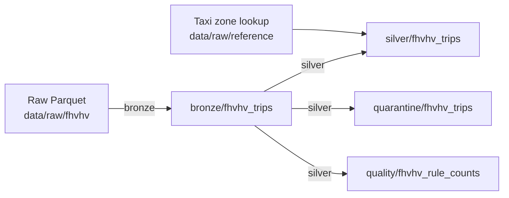

# Data model

All tables are Delta Lake tables partitioned by `data_month` (the first day of the month). Every run replaces
exactly one month in each table it writes ([ADR 0003](adr/0003-idempotent-monthly-partition-overwrite.md)).
Locally they live under `data/lakehouse/`.

## bronze/fhvhv_trips

Source rows conformed to the schema contract ([ADR 0007](adr/0007-explicit-bronze-schema-contract.md)).

| Column | Type | Notes |
|---|---|---|
| 25 source columns | as in `contracts.py` | `cbd_congestion_fee` is null before 2025 |
| `_source_file` | string | Name of the raw file |
| `_ingested_at` | timestamp | When the month was loaded; changes on a rerun |
| `data_month` | date | Partition column |

## silver/fhvhv_trips

Rows that passed every reject rule ([ADR 0006](adr/0006-data-quality-rules-and-silver-schema.md)).

| Column | Type | Notes |
|---|---|---|
| 25 source columns | as in bronze | Timestamps are New York local time (`timestamp_ntz`) |
| `pickup_borough`, `pickup_zone` | string | From the TLC taxi zone lookup; null if the zone ID is not in the lookup |
| `dropoff_borough`, `dropoff_zone` | string | Same |
| `quality_warnings` | array&lt;string&gt; | IDs of the warning rules the row triggered, for example `["W001"]` |
| `_source_file` | string | Lineage back to the raw file |
| `data_month` | date | Partition column |

## quarantine/fhvhv_trips

Rows that failed at least one reject rule ([ADR 0004](adr/0004-quarantine-failed-rows.md)). Nothing is
dropped silently: every rejected row is here with the reason.

| Column | Type | Notes |
|---|---|---|
| 25 source columns | as in bronze | Original values |
| `failed_rules` | array&lt;string&gt; | IDs of the reject rules the row failed, for example `["Q004", "Q005"]` |
| `quality_warnings` | array&lt;string&gt; | Warning rules the row also triggered |
| `_source_file` | string | |
| `data_month` | date | Partition column |

## quality/fhvhv_rule_counts

One row per rule per month. A sudden change in these counts is the signal that the source changed.

| Column | Type | Notes |
|---|---|---|
| `data_month` | date | Partition column |
| `rule_id` | string | `Q001`-`Q007`, `W001`-`W005` |
| `severity` | string | `reject` or `warning` |
| `description` | string | Short rule description |
| `matched_rows` | bigint | Rows of the month that matched the rule |
| `total_rows` | bigint | Rows of the month in bronze |

A row can match several rules, so `matched_rows` of different rules do not add up to the quarantine size.
